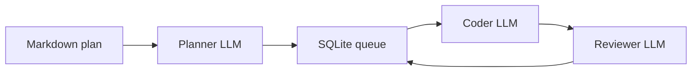

# Local AI Agent Orchestrator

[](LICENSE)
[](https://github.com/KEYHAN-A/local-ai-agent-orchestrator)
[](https://KEYHAN-A.github.io/local-ai-agent-orchestrator/)

**Repository:** [github.com/KEYHAN-A/local-ai-agent-orchestrator](https://github.com/KEYHAN-A/local-ai-agent-orchestrator)  
**Live site:** [KEYHAN-A.github.io/local-ai-agent-orchestrator](https://KEYHAN-A.github.io/local-ai-agent-orchestrator/)

**License:** [GPL-3.0-only](LICENSE)

A lightweight, framework-free **multi-agent coding orchestrator** for **local LLMs** served by [LM Studio](https://lmstudio.ai/) (OpenAI-compatible API). It runs a **planner → coder → reviewer** pipeline with **SQLite-backed** task queues, **explicit model load/unload**, and a **macOS memory gate** to reduce swap thrashing when swapping 20GB+ models on unified memory.

- **Planner:** decomposes a master plan into file-level micro-tasks (JSON).
- **Coder:** implements tasks with tool use (`file_read`, `file_write`, `shell_exec`, …).
- **Reviewer:** validates output (APPROVED / REJECTED with feedback).
- **Embedder:** optional semantic file retrieval before coding (Nomic via LM Studio).

## Why not CrewAI / LangChain here?

This project uses the **OpenAI Python SDK** directly against LM Studio to avoid multi-agent framework token overhead (ReAct scaffolding) on small local context windows.

## Requirements

- Python **3.10+**
- LM Studio with local server enabled
- Models you configure in `factory.yaml` (see [docs/CONFIGURATION.md](docs/CONFIGURATION.md))
- **Apple Silicon tip:** disable overly strict LM Studio **Model Loading Guardrails** if large models fail to load (Developer → Server Settings).

## Install

```bash
cd local-ai-agent-orchestrator
python -m venv .venv
source .venv/bin/activate   # Windows: .venv\Scripts\activate
pip install -e .
```

Or run without install (adds `src/` automatically):

```bash
python main.py health
```

## Quick start

```bash
# Generate example config
lao init
cp factory.example.yaml factory.yaml
# Edit factory.yaml: set lm_studio_base_url, total_ram_gb, and model keys from `lms ls`

lao health
lao run
# In another terminal: add plans/*.md or use:
lao run --plan plans/my_project.md --single-run
```

### CLI (`lao`)

| Command | Description |
|--------|-------------|
| `lao run` | Watch `plans/`, process queue (default if no subcommand) |
| `lao run --plan FILE` | Ingest one plan and process |
| `lao run --single-run` | One pass then exit |
| `lao status` | SQLite queue + token stats |
| `lao health` | LM Studio reachability + model keys |
| `lao reset-failed` | Move `failed` tasks back to `pending` |
| `lao init` | Write `factory.example.yaml`, ensure dirs |

### Global flags

| Flag | Purpose |
|------|---------|
| `--config PATH` | `factory.yaml` (default: `./factory.yaml` if present) |
| `--lm-studio-url URL` | Override base URL |
| `--ram-gb N` | Total RAM (logged; future tuning) |
| `--workspace`, `--plans-dir`, `--db` | Paths |
| `--planner-model`, `--coder-model`, `--reviewer-model`, `--embedder-model` | Override keys without editing YAML |

Environment: `LM_STUDIO_BASE_URL`, `OPENAI_API_KEY`, `LAO_CONFIG` (path to yaml), `TOTAL_RAM_GB`, `WORKSPACE_ROOT`, `PLANS_DIR`, `DB_PATH`. See [.env.example](.env.example).

## Architecture

See [docs/ARCHITECTURE.md](docs/ARCHITECTURE.md).



## Documentation

- [docs/ARCHITECTURE.md](docs/ARCHITECTURE.md)
- [docs/CONFIGURATION.md](docs/CONFIGURATION.md)
- [docs/CONTRIBUTING.md](docs/CONTRIBUTING.md)
- [site/index.html](site/index.html) — same landing page for local preview (mirrors [docs/index.html](docs/index.html) served on Pages)

## GitHub and GitHub Pages

This project is **open source** on GitHub: [KEYHAN-A/local-ai-agent-orchestrator](https://github.com/KEYHAN-A/local-ai-agent-orchestrator).

**GitHub Pages** serves the static site from the `docs/` folder on `main` (with [docs/.nojekyll](docs/.nojekyll) so paths are served as static files):

- **Live site:** [https://KEYHAN-A.github.io/local-ai-agent-orchestrator/](https://KEYHAN-A.github.io/local-ai-agent-orchestrator/)

To clone and contribute:

```bash
git clone https://github.com/KEYHAN-A/local-ai-agent-orchestrator.git
cd local-ai-agent-orchestrator
```

## Disclaimer

This software can execute shell commands and write files as configured. Run in a trusted workspace. GPL-3.0 applies to this project; third-party libraries have their own licenses.
