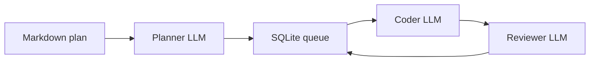

# Local AI Agent Orchestrator

[](LICENSE)
[](https://github.com/KEYHAN-A/local-ai-agent-orchestrator)
[](https://KEYHAN-A.github.io/local-ai-agent-orchestrator/)

**Repository:** [github.com/KEYHAN-A/local-ai-agent-orchestrator](https://github.com/KEYHAN-A/local-ai-agent-orchestrator)  
**Live site:** [KEYHAN-A.github.io/local-ai-agent-orchestrator](https://KEYHAN-A.github.io/local-ai-agent-orchestrator/)

**License:** [GPL-3.0-only](LICENSE)

A lightweight, framework-free **multi-agent coding orchestrator** for **local LLMs** served by [LM Studio](https://lmstudio.ai/) (OpenAI-compatible API). It runs a **planner → coder → reviewer** pipeline with **SQLite-backed** task queues, **explicit model load/unload**, and a **macOS memory gate** to reduce swap thrashing when swapping 20GB+ models on unified memory.

- **Planner:** decomposes a master plan into file-level micro-tasks (JSON).
- **Coder:** implements tasks with tool use (`file_read`, `file_write`, `shell_exec`, …).
- **Reviewer:** validates output (APPROVED / REJECTED with feedback); **v1.1.0+** parses verdicts after stripping reasoning / *think*-block prefixes (R1-style models).
- **Embedder:** optional semantic file retrieval before coding (Nomic via LM Studio).

## Why not CrewAI / LangChain here?

This project uses the **OpenAI Python SDK** directly against LM Studio to avoid multi-agent framework token overhead (ReAct scaffolding) on small local context windows.

## Requirements

- Python **3.10+**
- LM Studio with local server enabled
- Models you configure in `factory.yaml` (see [docs/CONFIGURATION.md](docs/CONFIGURATION.md))
- **Apple Silicon tip:** disable overly strict LM Studio **Model Loading Guardrails** if large models fail to load (Developer → Server Settings).

## Install

```bash
cd local-ai-agent-orchestrator
python -m venv .venv
source .venv/bin/activate   # Windows: .venv\Scripts\activate
pip install -e .
```

Or run without install (adds `src/` automatically):

```bash
python main.py health
```

### From PyPI

```bash
pip install local-ai-agent-orchestrator
```

**v1.3.0** adds optional **per-plan Git** commits (`lao(plan|architect|coder|reviewer): …`). **v1.2.0** added **`rich`** (terminal dashboard). Upgrade with `pip install -U local-ai-agent-orchestrator`.

## Quick start

```bash
# Generate example config
lao init
cp factory.example.yaml factory.yaml
# Edit factory.yaml: set lm_studio_base_url, total_ram_gb, and model keys from `lms ls`

lao health
lao run
# In another terminal: add plans/*.md or use:
lao --plan plans/my_project.md --single-run run
```

### CLI (`lao`)

| Command | Description |
|--------|-------------|
| `lao run` | Watch `plans/`, process queue (default if no subcommand) |
| `lao --plan FILE run` | Ingest one plan and process |
| `lao --single-run run` | One pass then exit |
| `lao status` | SQLite queue + token stats |
| `lao health` | LM Studio reachability + model keys |
| `lao reset-failed` | Move `failed` tasks back to `pending` |
| `lao init` | Write `factory.example.yaml`, `.lao/`, `plans/`, optional `README.md` |

### Global flags

| Flag | Purpose |
|------|---------|
| `--config PATH` | `factory.yaml` (default: `./factory.yaml` if present) |
| `--lm-studio-url URL` | Override base URL |
| `--ram-gb N` | Total RAM (logged; future tuning) |
| `--plain` | Classic scrolling log instead of the full-screen dashboard |
| `--no-git` | Disable per-plan Git snapshots and phase commits (overrides `factory.yaml`) |
| `--workspace`, `--plans-dir`, `--db` | Paths |
| `--planner-model`, `--coder-model`, `--reviewer-model`, `--embedder-model` | Override keys without editing YAML |

Environment: `LM_STUDIO_BASE_URL`, `OPENAI_API_KEY`, `LAO_CONFIG` (path to yaml), `TOTAL_RAM_GB`, `WORKSPACE_ROOT`, `PLANS_DIR`, `DB_PATH`. See [.env.example](.env.example).

### Project layout (v1.2.0+)

After `lao init` and copying `factory.yaml`, code for **`plans/MyPlan.md`** is written under **`./MyPlan/`** (same folder name as the plan stem, next to `plans/`). The database defaults to **`.lao/state.db`**. **`plans/README.md`** is never treated as a plan. See [docs/CONFIGURATION.md](docs/CONFIGURATION.md).

On a TTY, **`lao run`** uses a **fixed Rich dashboard** (phase, task, model swap line, memory gate summary, queue counts, filtered activity log). Use **`--plain`** for the old timestamped scrolling log (CI, pipes, or debugging).

### Git traceability (v1.3.0+)

For each plan, LAO targets **`<config_dir>/<plan-stem>/`** (your project folder). When **`git.enabled`** is true in `factory.yaml` (default), LAO runs **`git init`** if needed, writes **`LAO_PLAN.md`** (plan snapshot), then commits after the **plan snapshot**, **architect** (writes **`LAO_TASKS.json`**), **coder**, and **reviewer** (appends **`LAO_REVIEW.log`**). Subjects look like **`lao(coder): task #42 …`** so you can **`git log`** or revert step by step. Requires **`git`** on your `PATH` and a configured **`user.name` / `user.email`** (repo-local or global). Disable with **`git.enabled: false`** or **`lao --no-git run`**.

## Architecture

See [docs/ARCHITECTURE.md](docs/ARCHITECTURE.md).



## Documentation

- [docs/ARCHITECTURE.md](docs/ARCHITECTURE.md)
- [docs/CONFIGURATION.md](docs/CONFIGURATION.md)
- [docs/CONTRIBUTING.md](docs/CONTRIBUTING.md)
- [docs/PYPI_PUBLISH.md](docs/PYPI_PUBLISH.md) — publishing to PyPI
- [site/index.html](site/index.html) — same landing page for local preview (mirrors [docs/index.html](docs/index.html) served on Pages)

## GitHub and GitHub Pages

This project is **open source** on GitHub: [KEYHAN-A/local-ai-agent-orchestrator](https://github.com/KEYHAN-A/local-ai-agent-orchestrator).

**GitHub Pages** serves the static site from the `docs/` folder on `main` (with [docs/.nojekyll](docs/.nojekyll) so paths are served as static files):

- **Live site:** [https://KEYHAN-A.github.io/local-ai-agent-orchestrator/](https://KEYHAN-A.github.io/local-ai-agent-orchestrator/)

To clone and contribute:

```bash
git clone https://github.com/KEYHAN-A/local-ai-agent-orchestrator.git
cd local-ai-agent-orchestrator
```

## Changelog

### v1.3.0

- **Git:** Optional per-plan repo under **`./<plan-stem>/`**: snapshot **`LAO_PLAN.md`**, **`LAO_TASKS.json`** after architect, commits after coder/reviewer with **`lao(…):`** messages; **`LAO_REVIEW.log`** for review outcomes. Config **`git:`** in `factory.yaml`; CLI **`--no-git`**.
- **Site:** Redesigned GitHub Pages landing (hero, features, install).

### v1.2.0

- **Layout:** Per-plan code lives at **`./<plan-stem>/`** next to `plans/` (not under `.lao/workspaces/`). Fallback workspace **`.lao/_misc/`**.
- **CLI:** Rich **full-screen dashboard** on TTY (`--plain` for classic log). **`lao init`** adds workspace **`README.md`** when missing (`--skip-readme` to skip).
- **Fix:** SQLite no longer opens a bogus **`None`** database file when using the default `TaskQueue()` constructor.
- **Branding:** LAO palette on CLI, site, and docs.

### v1.1.1

- **Layout (superseded in v1.2.0):** `lao init` created **`.lao/workspaces/`** + **`plans/`**; per-plan workspace was **`.lao/workspaces/<plan-stem>/`** (from `plans/Foo.md` → `Foo`).
- **Plans:** Ignore **`plans/README.md`** when scanning for plans.
- **Defaults:** Reviewer model default **mlx-community/DeepSeek-R1-Distill-Qwen-32B-4bit** (adjust `key` to match `lms ls`).
- **Docs:** [docs/PYPI_PUBLISH.md](docs/PYPI_PUBLISH.md); local token notes template **`PYPI_PUBLISH.local.md`** (gitignored).

### v1.1.0

- **Reviewer:** Strip chain-of-thought (*think* tags) and detect `APPROVED` / `REJECTED` on any line — fixes false rejections from DeepSeek-R1–style reasoning before the verdict.
- Docs and landing page updated for this release.

### v1.0.0

- Initial stable release: `lao` CLI, planner / coder / reviewer pipeline, SQLite state, memory gate, GitHub Pages docs.

## Disclaimer

This software can execute shell commands and write files as configured. Run in a trusted workspace. GPL-3.0 applies to this project; third-party libraries have their own licenses.
