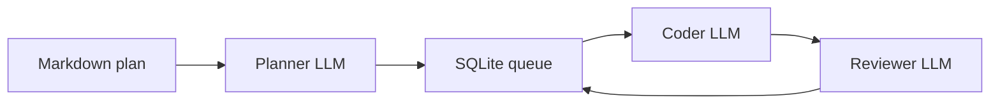

# Local AI Agent Orchestrator

**Local multi-agent coding pipeline** for [LM Studio](https://lmstudio.ai/) and other OpenAI-compatible local servers: planner, coder, and reviewer with SQLite state, memory-aware model swaps, optional per-plan Git commits, and a unified interactive CLI UX across `lao`, `lao init`, `lao configure-models`, and `lao run`.

[](https://pypi.org/project/local-ai-agent-orchestrator/)
[](https://pypi.org/project/local-ai-agent-orchestrator/)
[](LICENSE)
[](https://github.com/KEYHAN-A/local-ai-agent-orchestrator)
[](https://lao.keyhan.info)

| Resource | Link |
|----------|------|
| **PyPI package** | [https://pypi.org/project/local-ai-agent-orchestrator/](https://pypi.org/project/local-ai-agent-orchestrator/) |
| **Project website** | [https://lao.keyhan.info](https://lao.keyhan.info) |
| **Source code** | [https://github.com/KEYHAN-A/local-ai-agent-orchestrator](https://github.com/KEYHAN-A/local-ai-agent-orchestrator) |
| **Issues & feature requests** | [https://github.com/KEYHAN-A/local-ai-agent-orchestrator/issues](https://github.com/KEYHAN-A/local-ai-agent-orchestrator/issues) |
| **License** | [GPL-3.0-only](LICENSE) — [`LICENSE`](LICENSE) file in this repository |

Install: `pip install local-ai-agent-orchestrator` (CLI: **`lao`**). Upgrade: `pip install -U local-ai-agent-orchestrator`.

**Highlights**

- **Planner:** decomposes a master plan into file-level micro-tasks (JSON).
- **Coder:** implements tasks with tool use (`file_read`, `file_write`, `shell_exec`, …).
- **Reviewer:** validates output (APPROVED / REJECTED with feedback); **v1.1.0+** parses verdicts after stripping reasoning / *think*-block prefixes (R1-style models).
- **Embedder:** optional semantic file retrieval before coding (Nomic via LM Studio).
- **Git (v1.3.0+):** optional commits in each plan’s project folder (`LAO_PLAN.md`, `LAO_TASKS.json`, `LAO_REVIEW.log`, `lao(architect|coder|reviewer): …` messages). See [Git traceability](#git-traceability) below.
- **Unified CLI UX (v2.0.0+):** one polished flow from home/status (`lao`) to onboarding (`lao init`) to recovery (`lao configure-models`) and execution (`lao run`).
- **Resume by default:** interrupted `coding`/`review` tasks recover on restart; same plan content is deduplicated instead of re-decomposed.

## Why not CrewAI / LangChain here?

This project uses the **OpenAI Python SDK** directly against LM Studio to avoid multi-agent framework token overhead (ReAct scaffolding) on small local context windows.

## Requirements

- Python **3.10+**
- LM Studio with local server enabled
- Models you configure in `factory.yaml` (see [docs/CONFIGURATION.md](docs/CONFIGURATION.md))
- **Apple Silicon tip:** disable overly strict LM Studio **Model Loading Guardrails** if large models fail to load (Developer → Server Settings).

## Install

```bash
cd local-ai-agent-orchestrator
python -m venv .venv
source .venv/bin/activate   # Windows: .venv\Scripts\activate
pip install -e .
```

Or run without install (adds `src/` automatically):

```bash
python main.py health
```

### From PyPI

```bash
pip install local-ai-agent-orchestrator
# pip install -U local-ai-agent-orchestrator   # upgrade
```

Package index: [https://pypi.org/project/local-ai-agent-orchestrator/](https://pypi.org/project/local-ai-agent-orchestrator/).

## Quick start

```bash
# Open interactive LAO home assistant
lao
# or run setup directly:
lao init

lao health
lao run
# In another terminal: add plans/*.md or use:
lao --plan plans/my_project.md --single-run run
```

### CLI (`lao`)

| Command | Description |
|--------|-------------|
| `lao run` | Watch `plans/`, process queue |
| `lao` | Interactive home assistant: environment status + guided next actions |
| `lao --plan FILE run` | Ingest one plan and process |
| `lao --single-run run` | One pass then exit |
| `lao status` | SQLite queue + token stats |
| `lao health` | LM Studio reachability + model keys |
| `lao configure-models` | Interactive remap of planner/coder/reviewer/embedder model keys |
| `lao retry-failed` | Retry failed tasks by moving `failed` tasks back to `pending` |
| `lao reset-failed` | Deprecated alias for `lao retry-failed` |
| `lao init` | Interactive onboarding: writes `factory.yaml` (+ `factory.example.yaml`), `.lao/`, `plans/`, optional `README.md` |

On TTY terminals, `lao`, `lao init`, `lao configure-models`, and `lao run` use a unified Rich-based visual style (branded panels, status tables, guided choices) for one seamless operator flow.

### Global flags

| Flag | Purpose |
|------|---------|
| `--config PATH` | `factory.yaml` (default: `./factory.yaml` if present) |
| `--lm-studio-url URL` | Override base URL |
| `--ram-gb N` | Total RAM (logged; future tuning) |
| `--plain` | Classic scrolling log instead of the full-screen dashboard |
| `--no-git` | Disable per-plan Git snapshots and phase commits (overrides `factory.yaml`) |
| `--workspace`, `--plans-dir`, `--db` | Paths |
| `--planner-model`, `--coder-model`, `--reviewer-model`, `--embedder-model` | Override keys without editing YAML |

Environment: `LM_STUDIO_BASE_URL`, `OPENAI_API_KEY`, `LAO_CONFIG` (path to yaml), `TOTAL_RAM_GB`, `WORKSPACE_ROOT`, `PLANS_DIR`, `DB_PATH`. See [.env.example](.env.example).

### Project layout (v1.2.0+)

After `lao init`, code for **`plans/MyPlan.md`** is written under **`./MyPlan/`** (same folder name as the plan stem, next to `plans/`). The database defaults to **`.lao/state.db`**. **`plans/README.md`** is never treated as a plan. See [docs/CONFIGURATION.md](docs/CONFIGURATION.md).

Resume behavior: restarting `lao run` continues queue progress from SQLite; tasks interrupted mid-phase are recovered automatically. If you reuse the exact same plan content, LAO recognizes it and avoids starting over.

On a TTY, **`lao run`** uses a **fixed Rich dashboard** (phase, task, model swap line, memory gate summary, queue counts, filtered activity log). Use **`--plain`** for the old timestamped scrolling log (CI, pipes, or debugging).

### Git traceability

Since **v1.3.0**, for each plan LAO targets **`<config_dir>/<plan-stem>/`** (your project folder). When **`git.enabled`** is true in `factory.yaml` (default), LAO runs **`git init`** if needed, writes **`LAO_PLAN.md`** (plan snapshot), then commits after the **plan snapshot**, **architect** (writes **`LAO_TASKS.json`**), **coder**, and **reviewer** (appends **`LAO_REVIEW.log`**). Subjects look like **`lao(coder): task #42 …`** so you can **`git log`** or revert step by step. Requires **`git`** on your `PATH` and a configured **`user.name` / `user.email`** (repo-local or global). Disable with **`git.enabled: false`** or **`lao --no-git run`**.

## Architecture

See [docs/ARCHITECTURE.md](docs/ARCHITECTURE.md).



## Documentation

- **Website (marketing & overview):** [https://lao.keyhan.info](https://lao.keyhan.info) — built from [`docs/index.html`](docs/index.html) on the default branch ([`docs/.nojekyll`](docs/.nojekyll) for static assets).
- [docs/ARCHITECTURE.md](docs/ARCHITECTURE.md) — modules, queue, model swapping, Git commit cadence
- [docs/CONFIGURATION.md](docs/CONFIGURATION.md) — `factory.yaml`, paths, `git:` settings
- [docs/CONTRIBUTING.md](docs/CONTRIBUTING.md)
- [docs/PYPI_PUBLISH.md](docs/PYPI_PUBLISH.md) — maintainers: publishing to PyPI

Clone for development:

```bash
git clone https://github.com/KEYHAN-A/local-ai-agent-orchestrator.git
cd local-ai-agent-orchestrator
```

## Changelog

### v2.2.0

- **Pipeline completion correctness:** plans now move to `completed` when all tasks reach a terminal state (`completed` or `failed`) instead of staying `active`.
- **Recovery ergonomics:** added `lao retry-failed` (with `reset-failed` alias) backed by queue API support to quickly re-run failed tasks.
- **Scheduler robustness:** pending tasks that depend on failed prerequisites are now auto-failed with explicit dependency-block feedback.
- **Reviewer quality gate tuning:** reviewer guidance and parsing now treat minor-only feedback as non-blocking, reducing over-rejection loops on local models.
- **Test coverage:** added tests for terminal-plan detection, failed-task reset, failed-dependency scheduling behavior, and reviewer minor-finding approval behavior.

### v2.1.1

- **Website metadata:** replaced hardcoded site version text with live GitHub/PyPI badges and direct latest-release links.
- **Publish workflow reliability:** release-triggered PyPI automation now avoids duplicate tag/release uploads while keeping manual re-run support.

### v2.1.0

- **Orchestration quality:** planner chunk-resume preflight, dependency-aware scheduling, role-batched coder/reviewer waves, and structured findings storage.
- **Production gates:** validator framework for placeholder/schema/project-integrity checks, configurable quality gates, and per-plan `quality_report.json` traceability.
- **Release automation:** GitHub Actions workflow added for automated PyPI publish on release/tag with Trusted Publishing support.

### v2.0.0

- **Unified UX:** `lao`, `lao init`, and `lao configure-models` now match the polished `lao run` visual language with guided, step-based TTY flows.
- **Operator continuity:** post-setup/post-config next actions (`health`/`run`) are integrated, reducing dead ends between commands.
- **Recovery clarity:** startup checks and model-remap guidance are surfaced as first-class interactive flows for smoother long-running operation.

### v1.3.0

- **Git:** Optional per-plan repo under **`./<plan-stem>/`**: snapshot **`LAO_PLAN.md`**, **`LAO_TASKS.json`** after architect, commits after coder/reviewer with **`lao(…):`** messages; **`LAO_REVIEW.log`** for review outcomes. Config **`git:`** in `factory.yaml`; CLI **`--no-git`**.
- **Site:** Redesigned GitHub Pages landing (hero, features, install).

### v1.2.0

- **Layout:** Per-plan code lives at **`./<plan-stem>/`** next to `plans/` (not under `.lao/workspaces/`). Fallback workspace **`.lao/_misc/`**.
- **CLI:** Rich **full-screen dashboard** on TTY (`--plain` for classic log). **`lao init`** adds workspace **`README.md`** when missing (`--skip-readme` to skip).
- **Fix:** SQLite no longer opens a bogus **`None`** database file when using the default `TaskQueue()` constructor.
- **Branding:** LAO palette on CLI, site, and docs.

### v1.1.1

- **Layout (superseded in v1.2.0):** `lao init` created **`.lao/workspaces/`** + **`plans/`**; per-plan workspace was **`.lao/workspaces/<plan-stem>/`** (from `plans/Foo.md` → `Foo`).
- **Plans:** Ignore **`plans/README.md`** when scanning for plans.
- **Defaults:** Reviewer model default **deepseek-r1-distill-qwen-32b** (adjust `key` to match `lms ls`).
- **Docs:** [docs/PYPI_PUBLISH.md](docs/PYPI_PUBLISH.md); local token notes template **`PYPI_PUBLISH.local.md`** (gitignored).

### v1.1.0

- **Reviewer:** Strip chain-of-thought (*think* tags) and detect `APPROVED` / `REJECTED` on any line — fixes false rejections from DeepSeek-R1–style reasoning before the verdict.
- Docs and landing page updated for this release.

### v1.0.0

- Initial stable release: `lao` CLI, planner / coder / reviewer pipeline, SQLite state, memory gate, GitHub Pages docs.

## Disclaimer

This software can execute shell commands and write files as configured. Run in a trusted workspace. GPL-3.0 applies to this project; third-party libraries have their own licenses.
