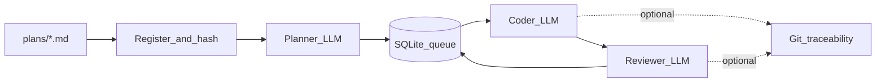
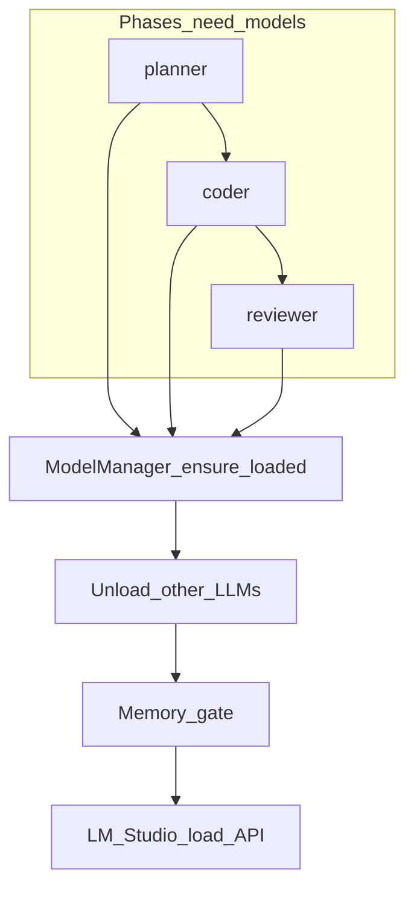

# Local AI Agent Orchestrator (LAO)

**LAO** is a local, multi-phase coding agent for [LM Studio](https://lmstudio.ai/) and other **OpenAI-compatible** servers. It turns a markdown plan into queued micro-tasks, runs a **coder** with filesystem tools, then a **reviewer** with structured feedback—backed by **SQLite** state, **memory-aware model swapping**, optional **per-plan Git** history, and a unified **Rich** CLI.

[](https://pypi.org/project/local-ai-agent-orchestrator/)
[](https://pypi.org/project/local-ai-agent-orchestrator/)
[](https://github.com/KEYHAN-A/local-ai-agent-orchestrator/releases/latest)
[](LICENSE)
[](https://github.com/KEYHAN-A/local-ai-agent-orchestrator)
[](https://lao.keyhan.info)

| Resource | Link |
|----------|------|
| **PyPI** | [pypi.org/project/local-ai-agent-orchestrator](https://pypi.org/project/local-ai-agent-orchestrator/) |
| **Website** | [lao.keyhan.info](https://lao.keyhan.info) |
| **Repository** | [github.com/KEYHAN-A/local-ai-agent-orchestrator](https://github.com/KEYHAN-A/local-ai-agent-orchestrator) |
| **Issues** | [GitHub Issues](https://github.com/KEYHAN-A/local-ai-agent-orchestrator/issues) |
| **License** | [GPL-3.0-only](LICENSE) |
| **Changelog** | [CHANGELOG.md](CHANGELOG.md) |

---

## Table of contents

- [Features](#features)
- [Why the OpenAI SDK (not LangChain / CrewAI)?](#why-the-openai-sdk-not-langchain--crewai)
- [Requirements](#requirements)
- [Installation](#installation)
- [Quick start](#quick-start)
- [Configuration overview](#configuration-overview)
- [CLI reference](#cli-reference)
- [Workspaces, paths, and resume behavior](#workspaces-paths-and-resume-behavior)
- [Git traceability](#git-traceability)
- [Architecture](#architecture)
- [Documentation](#documentation)
- [Security](#security)
- [Contributing](#contributing)
- [Releases](#releases)

---

## Features

### End-to-end pipeline

- **Planner (architect):** Decomposes a master plan into a JSON array of micro-tasks (title, description, file paths, dependencies). Large plans are **chunked** to fit the planner context; completed chunks are **resumed** instead of recomputed.
- **Task queue:** **SQLite** (WAL) stores plans, tasks, run logs, and structured review findings. **Dependency-aware** scheduling: tasks wait on prerequisites; dependents of **failed** tasks are failed with explicit feedback.
- **Coder:** OpenAI-style chat with **tool calling** (when the model supports it): `file_read`, `file_write`, `file_patch`, `list_dir`, `shell_exec`. Work runs inside the **active plan workspace** (see below).
- **Reviewer:** Single completion that must yield structured JSON (`verdict`, `findings`, `summary`). Feeds back into queue state (approve, rework, or fail after max attempts).

### State, recovery, and operator tools

- **Resume by default:** On startup, tasks stuck in transient phases are reset (`coding` → `pending`, `review` → `coded`) via `recover_interrupted()`.
- **Plan deduplication:** Identical plan **content** is hashed; resubmitting the same text does not spawn a second decomposition.
- **`lao retry-failed`:** Moves `failed` tasks back to `pending` for another pass. **`lao reset-failed`** is a deprecated alias.

### Models and memory

- **Role-specific models** in `factory.yaml` (`planner`, `coder`, `reviewer`, optional `embedder`).
- **ModelManager** loads/unloads via LM Studio’s HTTP API so only one large LLM tends to sit in VRAM at a time.
- **Memory gate:** After unload, waits until freed memory (via `vm_stat` on macOS) meets configured thresholds before loading the next model.
- **LLM retries:** Configurable timeouts, attempts, and exponential backoff for transient API errors.

### Semantic context (embedder)

- When configured, **embedding search** (`find_relevant_files`) can rank files before coding so the coder prompt includes short excerpts from likely-relevant paths (see `tools.py`).

### Quality gates and validation

- **Post-coder validation** (placeholder text, selected code smells, optional **`validation_build_cmd`** / **`validation_lint_cmd`** when set in config) produces **findings**; severity drives gating when `quality_gate_mode` is `standard` or `strict`.
- **Per-plan `quality_report.json`** summarizes runs and findings for traceability (see `reporting` module and docs).

### Reviewer robustness (local models)

- **Chain-of-thought stripping:** `<think>…</think>`-style blocks are removed before parsing reviewer output (R1 / Qwen-style models).
- **JSON verdict parsing:** Accepts raw JSON, JSON inside **markdown code fences**, or a JSON object embedded in surrounding prose—so `APPROVED` inside a fenced block is not misread as a rejection.

### Optional Git traceability

- When enabled, each plan’s project directory can be a Git repo: **`LAO_PLAN.md`**, **`LAO_TASKS.json`**, phase commits with subjects like **`lao(coder): task #42 …`**, and **`LAO_REVIEW.log`** appended after review. Disable globally in YAML or per run with **`--no-git`**.

### Operator experience

- **`lao` (no subcommand):** Interactive home on a TTY—status, guided next steps.
- **`lao init`:** Scaffold `factory.yaml` / `factory.example.yaml`, `.lao/`, `plans/`, optional workspace `README.md`.
- **`lao configure-models`:** Interactive remap of model keys to match `lms ls` / LM Studio.
- **`lao run`:** Full-screen **dashboard** on a TTY (phase, task, model line, memory gate, queue counts, activity). **`--plain`** yields classic timestamped logs (CI, pipes, debugging).

---

## Why the OpenAI SDK (not LangChain / CrewAI)?

LAO calls the **OpenAI Python SDK** directly against your local server to avoid heavy multi-agent framework scaffolding and extra token overhead on **small local context windows**.

---

## Requirements

- **Python 3.10+**
- **LM Studio** (or compatible server) with the API enabled
- Model **keys** in `factory.yaml` that match what the server exposes (use `lao health` or `lms ls`)
- **`git`** on `PATH` if you use Git traceability, with `user.name` / `user.email` configured
- **Apple Silicon:** if large models fail to load, relax LM Studio **Model Loading Guardrails** (Developer → Server Settings)

Full reference: **[docs/CONFIGURATION.md](docs/CONFIGURATION.md)**.

---

## Installation

### From PyPI (recommended)

```bash
pip install local-ai-agent-orchestrator
pip install -U local-ai-agent-orchestrator   # upgrade
```

The CLI entry point is **`lao`** (also `local-ai-agent-orchestrator`).

### Editable install (development)

```bash
git clone https://github.com/KEYHAN-A/local-ai-agent-orchestrator.git
cd local-ai-agent-orchestrator
python -m venv .venv
source .venv/bin/activate   # Windows: .venv\Scripts\activate
pip install -e .
```

### Without installing the package

```bash
python main.py health
```

(`main.py` adds `src/` for you.)

---

## Quick start

```bash
lao              # interactive home (TTY), or choose actions from the menu
lao init         # scaffold config, .lao/, plans/

lao health       # LM Studio reachability + configured model keys
lao run          # watch plans/, process queue (dashboard on TTY)

# Alternative: one plan, one pass
lao --plan plans/my_project.md --single-run run
```

Drop new **`*.md`** files into your configured **`plans/`** directory (by default next to `factory.yaml`). **`plans/README.md`** is never ingested as a plan.

---

## Configuration overview

Configuration lives in **`factory.yaml`** (or path from **`LAO_CONFIG`** / **`--config`**). Typical areas:

| Area | Purpose |
|------|---------|
| **`lm_studio_base_url`**, **`openai_api_key`** | Server endpoint and API key (LM Studio often uses a placeholder key). |
| **`paths.plans`**, **`paths.database`** | Where plans are scanned and where **SQLite** lives (default **`.lao/state.db`**). |
| **`memory_gate.*`** | Release fraction, swap growth limits, settle timeout, poll interval. |
| **`orchestration.*`** | Load timeouts, **`max_task_attempts`**, watch interval, LLM timeouts/retries, **`phase_gated`**, **`coder_batch_size`**, **`reviewer_batch_size`**, **`max_context_utilization`**, **`quality_gate_mode`**, optional **`validation_build_cmd`** / **`validation_lint_cmd`**. |
| **`git.*`** | Enable/disable traceability, plan snapshot filename, optional commit trailers. |
| **`models.*`** | Per-role **`key`**, **`context_length`**, **`max_completion`**, **`supports_tools`**, size hints for memory accounting. |

Environment variables (including **`LM_STUDIO_BASE_URL`**, **`OPENAI_API_KEY`**, **`TOTAL_RAM_GB`**, **`WORKSPACE_ROOT`**, **`PLANS_DIR`**, **`DB_PATH`**) are documented in **[.env.example](.env.example)**.

---

## CLI reference

### Commands

| Command | Description |
|---------|-------------|
| `lao` | Interactive home: environment status and guided actions (TTY). |
| `lao run` | Watch `plans/`, run architect/coder/reviewer loop until interrupted. |
| `lao init` | Onboarding scaffold: `factory.example.yaml`, `.lao/`, `plans/`, optional `README.md`. Flags: `--skip-readme`, `--no-interactive`. |
| `lao health` | Check server reachability and that configured model keys exist. |
| `lao status` | SQLite queue summary and token totals. |
| `lao configure-models` | Interactive update of planner/coder/reviewer/embedder keys in `factory.yaml`. |
| `lao retry-failed` | Reset **failed** tasks to **pending** for another attempt. |
| `lao reset-failed` | Deprecated alias for **`retry-failed`**. |

`lao run` accepts **`--plan PATH`** (single plan) and **`--single-run`** (one scheduler pass then exit).

### Global flags

| Flag | Description |
|------|-------------|
| `--config PATH` | Path to `factory.yaml` (default: `./factory.yaml` if present). |
| `--lm-studio-url URL` | Override LM Studio base URL. |
| `--ram-gb N` | Total RAM in GB (logged; reserved for future tuning). |
| `--workspace`, `--plans-dir`, `--db` | Override workspace, plans directory, and SQLite path. |
| `--planner-model`, `--coder-model`, `--reviewer-model`, `--embedder-model` | Override model keys without editing YAML. |
| `--plain` | Classic scrolling log instead of the full-screen run dashboard. |
| `--no-git` | Disable Git snapshots/commits for this run (overrides `factory.yaml`). |
| `--phase-gated` | Enable role-batched phase execution (coder/reviewer waves) for this run. |
| `--batch-size N` | Coder batch size override for this run. |
| `--max-context-utilization RATIO` | Planner context utilization hint (0–1). |
| `--quality-gate` | Override quality gate: `strict`, `standard`, or `off`. |

---

## Workspaces, paths, and resume behavior

- **Per-plan project directory:** For a plan file `plans/MyPlan.md`, the default workspace is **`<config_dir>/MyPlan/`** (same stem as the plan), i.e. next to your `plans/` folder after `lao init`. The coder’s file tools operate **inside that directory** (with safety checks).
- **Fallback:** If a plan has no normal stem, **`.lao/_misc/`** can be used as a fallback workspace (see configuration docs).
- **State database:** Default **`.lao/state.db`** unless overridden.
- **Resume:** Restarting **`lao run`** continues from SQLite; interrupted phases are recovered automatically.

On a TTY, **`lao run`** shows a fixed **Rich** dashboard; use **`--plain`** for logs suitable for CI or redirection.

---

## Git traceability

When **`git.enabled`** is true (default), LAO uses **`<config_dir>/<plan-stem>/`** as the Git working tree:

1. **Plan snapshot:** **`LAO_PLAN.md`** committed when appropriate (`lao(plan): …`).
2. **After architect:** **`LAO_TASKS.json`** (`lao(architect): …`).
3. **After coder:** staged changes (`lao(coder): task #…`).
4. **After reviewer:** **`LAO_REVIEW.log`** updated (`lao(reviewer): …`).

Disable with **`git.enabled: false`** or **`lao --no-git run`**. Existing **`.git`** directories are respected (no forced re-init).

---

## Architecture

Module-level detail: **[docs/ARCHITECTURE.md](docs/ARCHITECTURE.md)**.

### Pipeline overview



### Model loading and memory gate



---

## Documentation

| Doc | Description |
|-----|-------------|
| [docs/ARCHITECTURE.md](docs/ARCHITECTURE.md) | Components, execution flow, resume, Git, model swapping |
| [docs/CONFIGURATION.md](docs/CONFIGURATION.md) | `factory.yaml`, paths, orchestration, Git |
| [docs/CONTRIBUTING.md](docs/CONTRIBUTING.md) | How to contribute |
| [docs/PYPI_PUBLISH.md](docs/PYPI_PUBLISH.md) | Maintainer: publishing to PyPI |
| [lao.keyhan.info](https://lao.keyhan.info) | Project site (from [docs/index.html](docs/index.html)) |

---

## Security

LAO can **execute shell commands** and **write files** in the configured workspace as driven by the coder and your plan. Run only in **trusted** directories, use **`--no-git`** or disable tools if you need a read-only mental model, and review **`factory.yaml`** before production use. This project is **GPL-3.0-only**; dependencies have their own licenses.

---

## Contributing

Issues and pull requests are welcome. See **[docs/CONTRIBUTING.md](docs/CONTRIBUTING.md)** for guidelines.

---

## Releases

- **Latest changes:** see **[CHANGELOG.md](CHANGELOG.md)** (full history from v1.0.0).
- **Install the latest build:** `pip install -U local-ai-agent-orchestrator`
- **GitHub Releases:** [github.com/KEYHAN-A/local-ai-agent-orchestrator/releases](https://github.com/KEYHAN-A/local-ai-agent-orchestrator/releases)

**Recent highlights (v2.2.1):** reviewer JSON parsing accepts markdown-fenced and prose-wrapped payloads; regression tests for fenced `APPROVED` responses.
